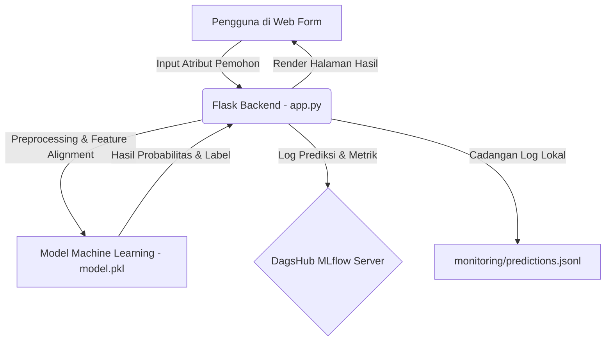

# LAPORAN AKADEMIK PROJEK
## DS CREDISHIELD ANALYTICS: SISTEM EVALUASI RISIKO KREDIT REAL-TIME & INTEGRASI MONITORING MLFLOW

---

### ABSTRAK
Dalam era digitalisasi keuangan (*fintech*), penilaian risiko kredit secara cepat dan akurat merupakan faktor krusial untuk menekan angka gagal bayar (*default rate*). Projek **DS CrediShield Analytics** membangun sebuah purwarupa sistem keputusan kredit terintegrasi yang menggabungkan aplikasi web interaktif berbasis Flask, model prediktif berbasis *Machine Learning* (XGBoost), pemantauan data waktu-nyata (*real-time monitoring*) via MLflow yang di-host di DagsHub, serta orkestrasi container menggunakan Docker untuk dideploy pada platform Railway. Laporan ini menjabarkan arsitektur perangkat lunak, perancangan antarmuka pengguna (termasuk implementasi *fixed sidebar*), mekanisme integrasi monitoring model, dan tahapan deployment sistem.

---

## 1. PENDAHULUAN

### 1.1 Latar Belakang
Penilaian kelayakan kredit tradisional seringkali memerlukan waktu pemrosesan dokumen yang lama dan rentan terhadap kesalahan subjektif. Dengan kemajuan *Machine Learning* dan *Web Development*, institusi keuangan dapat mengevaluasi kelayakan pemohon secara instan menggunakan algoritma klasifikasi. Namun, mengintegrasikan model prediktif ke dalam aplikasi web produksi memerlukan infrastruktur pemantauan (*monitoring*) yang kuat untuk melacak performa model dan menjaga akurasi dari waktu ke waktu.

### 1.2 Rumusan Masalah
1. Bagaimana merancang aplikasi web fintech yang responsif dengan performansi visual premium?
2. Bagaimana mengintegrasikan model prediksi risiko kredit (ML) ke dalam alur transaksi web?
3. Bagaimana memantau metrik prediksi secara *real-time* tanpa mengorbankan kecepatan aplikasi web?

### 1.3 Tujuan Projek
1. Membangun aplikasi web dashboard fintech menggunakan Flask dan Tailwind CSS.
2. Mengimplementasikan layout *fixed sidebar* (sidebar kiri tetap diam, konten kanan scrollable) guna meningkatkan kenyamanan navigasi pengguna.
3. Menyediakan form prediksi interaktif dengan mekanisme pertahanan nilai input (*form data retention*) pasca-submit.
4. Menghubungkan log prediksi web secara otomatis ke server tracking MLflow DagsHub.
5. Melakukan kontainerisasi aplikasi dengan Docker dan mendistribusikannya ke cloud Railway.

---

## 2. ARSITEKTUR & PERANCANGAN SISTEM

### 2.1 Alur Kerja Sistem (Workflow)
Sistem ini menggunakan pola arsitektur Model-View-Controller (MVC) sederhana yang difasilitasi oleh Flask:
1. **Frontend (View):** Pengguna menginputkan data pemohon kredit pada halaman `/prediksi`.
2. **Flask Backend (Controller):** Mengambil data form, mengubahnya menjadi *DataFrame* pandas yang sesuai dengan fitur latih model, dan menjalankan inferensi model.
3. **Machine Learning Model (Model):** File `model.pkl` (XGBoost) memproses data input untuk memprediksi probabilitas gagal bayar.
4. **Monitoring Logging:** Backend mengirimkan metrik hasil prediksi secara asinkron/aman ke **DagsHub MLflow Tracking Server** (dan menyimpannya sebagai berkas log lokal `.jsonl` sebagai cadangan).
5. **Output Rendering:** Menampilkan keputusan akhir: **AMAN** (risiko rendah) atau **MACET** (risiko tinggi) beserta nilai probabilitasnya ke pengguna tanpa me-reset form input.



### 2.2 Atribut Prediksi (Fitur Model)
Model dilatih menggunakan fitur-fitur keuangan nasabah berikut:
* **annual_income / pendapatan**: Pendapatan tahunan pemohon.
* **loan_amount / pinjaman**: Jumlah pinjaman yang diajukan.
* **debt_to_income / dti**: Rasio utang dibandingkan pendapatan (%).
* **interest_rate / interest_rate**: Suku bunga pinjaman (%).
* **emp_length / emp_length**: Masa kerja pemohon (dalam tahun).
* **term / tenor**: Durasi pinjaman (36 atau 60 bulan).
* **grade / grade**: Tingkat kelayakan kredit nasabah (A s.d. G).
* **loan_purpose / loan_purpose**: Tujuan pengajuan dana (misal: konsolidasi utang, renovasi rumah).

---

## 3. IMPLEMENTASI & DESAIN ANTARMUKA

### 3.1 Desain Layout: Fixed Sidebar
Untuk menghadirkan pengalaman pengguna (*User Experience*) yang premium layaknya aplikasi SaaS modern, struktur file layout [base.html](file:///c:/laragon/www/DS-CrediShield-Analytics/templates/base.html) dirancang agar bagian sidebar navigasi kiri tetap diam (*fixed/sticky*) saat konten di sebelah kanan digulir (*scroll*).

Penerapan kelas Tailwind CSS pada kerangka layout utama adalah sebagai berikut:
* **Pembungkus Induk (Body/Wrapper):** Menggunakan kelas `flex h-screen overflow-hidden` untuk membatasi tinggi aplikasi sesuai dengan ukuran layar peranti dan menyembunyikan gulir bawaan peranti.
* **Sidebar (`<aside>`):** Menggunakan kelas `w-64 flex-shrink-0 h-full overflow-y-auto` untuk memastikan lebar tetap 16rem, tidak menyusut, dan memiliki sistem gulir internal mandiri jika menu navigasi bertambah banyak.
* **Konten Kanan (Div Utama):** Menggunakan kelas `flex-1 h-full overflow-y-auto` sehingga area konten kanan dapat digulir secara independen tanpa memengaruhi sidebar kiri.

### 3.2 Fitur Form Data Retention
Saat pengguna menekan tombol "Jalankan Prediksi", data form dikirim melalui metode POST. Agar nilai input tidak hilang (kembali kosong) setelah halaman dimuat ulang, Flask mengembalikan objek `form_data` ke template Jinja2.
Setiap elemen input di [prediksi.html](file:///c:/laragon/www/DS-CrediShield-Analytics/templates/prediksi.html) diikat secara dinamis menggunakan sintaks Jinja2:
```html
<input value="{{ form_data.get('pendapatan', '') }}">
```
Dan untuk elemen pilihan dropdown (`<select>`):
```html
<option value="36" selected>36</option>
```

---

## 4. INTEGRASI MONITORING & DEPLOYMENT

### 4.1 Pelacakan Real-time dengan MLflow & DagsHub
Pemantauan terhadap model dilakukan dengan mencatat metrik inferensi ke platform DagsHub. Protokol autentikasi dasar HTTP (*Basic Authentication*) dijalankan oleh MLflow SDK secara otomatis dengan membaca variabel lingkungan:
1. `MLFLOW_TRACKING_URI`: Endpoint pelacakan repositori DagsHub Anda.
2. `MLFLOW_TRACKING_USERNAME`: Nama pengguna DagsHub (`adilanh`).
3. `MLFLOW_TRACKING_PASSWORD`: Token akses akun DagsHub.
4. `MLFLOW_EXPERIMENT_NAME`: Kategori eksperimen pelacakan.

Setiap kali prediksi dieksekusi, metrik `prediction_score` (probabilitas) dan `prediction_is_aman` (biner status kelayakan) dicatat secara terpusat untuk mendeteksi tanda-tanda pergeseran data (*data drift*) atau penurunan kualitas performansi model.

### 4.2 Kontainerisasi (Docker)
Projek dilengkapi dengan berkas [Dockerfile](file:///c:/laragon/www/DS-CrediShield-Analytics/Dockerfile) berbasis `python:3.12-slim` untuk menjamin konsistensi lingkungan jalannya program:
```dockerfile
FROM python:3.12-slim
ENV PYTHONDONTWRITEBYTECODE=1 \
    PYTHONUNBUFFERED=1 \
    PORT=8080
WORKDIR /app
RUN apt-get update && apt-get install -y --no-install-recommends libgomp1 && rm -rf /var/lib/apt/lists/*
COPY requirements.txt ./
RUN pip install --upgrade pip && pip install -r requirements.txt
COPY . ./
EXPOSE 8080
CMD ["sh", "-c", "gunicorn --bind 0.0.0.0:${PORT} --workers 2 --threads 4 --timeout 120 app:app"]
```
*Catatan: Dependensi `libgomp1` diinstal di dalam kontainer karena pustaka XGBoost membutuhkannya untuk komputasi paralel.*

### 4.3 Cloud Deployment (Railway)
Aplikasi di-deploy pada platform Railway dengan memanfaatkan integrasi git. Melalui Railway CLI, proyek dideploy secara instan menggunakan perintah:
```bash
railway up --service steadfast-peace
```
Platform Railway memindai root direktori, mendeteksi `Dockerfile`, mem-build citra kontainer secara otomatis, serta mengekspos port layanan melalui variabel lingkungan `PORT`.

---

## 5. KESIMPULAN & SARAN

### 5.1 Kesimpulan
Projek **DS CrediShield Analytics** telah sukses diintegrasikan dari hulu ke hilir. Sistem klasifikasi kelayakan kredit berbasis model XGBoost ini dapat melayani inferensi waktu-nyata secara aman, mempertahankan status input data pada antarmuka, serta berhasil dipantau kinerjanya menggunakan tracking server MLflow DagsHub. Aplikasi web yang dikontainerisasi dengan Docker juga berhasil berjalan stabil di cloud Railway.

### 5.2 Saran Pengembangan
1. **Keamanan:** Menambahkan sistem autentikasi pengguna (misal menggunakan Flask-Login) untuk mengamankan halaman prediksi dan dasbor.
2. **Automated Retraining:** Membuat skrip otomatis (*pipeline*) untuk melatih kembali model secara berkala apabila data log prediksi di DagsHub sudah terkumpul dalam jumlah tertentu (mendeteksi *model drift*).
3. **Database Relasional:** Menggantikan penyimpanan log lokal `.jsonl` dengan database SQL terstruktur (misal PostgreSQL di Railway) guna penyimpanan riwayat transaksi yang lebih kokoh.
